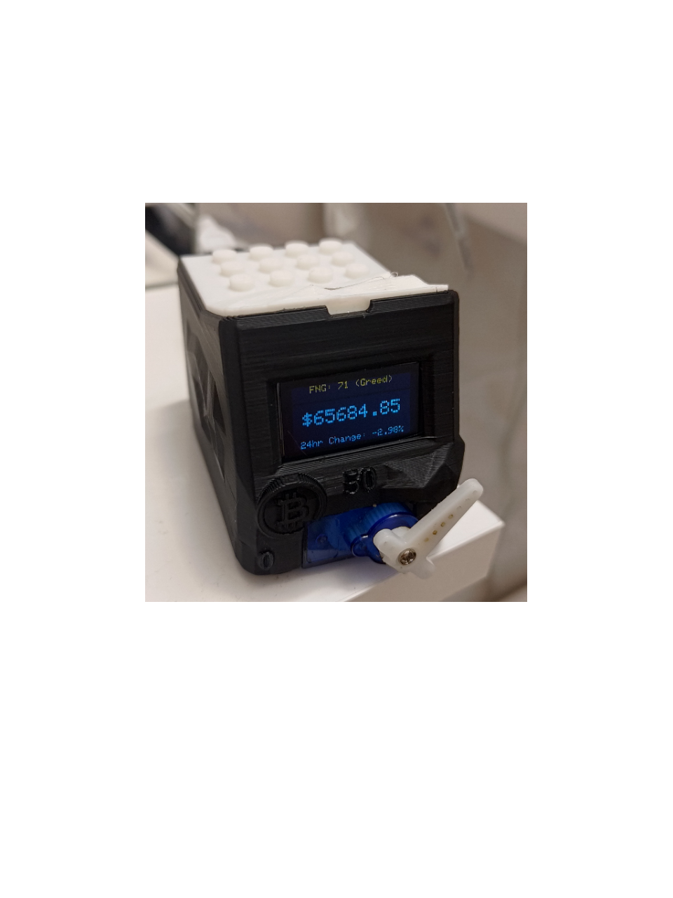

# bitcoin-device
**used to track the bitcoin and show greed index**

___
inspired by 
https://github.com/SonnyBrooks/bitcoin-ticker-esp32
and model taken from
https://www.thingiverse.com/thing:2751157/makes
(and some changes to fit)

**!** the model is need some manual changes,
there is an error in the model, the servo does not fit and needs either to be enlarged or to modify the model
___
- Line 0: Centered Fear and Greed Index data (e.g., "FNG: 72 (Greed)")
- Line 1-4: Blank or used as spacing
- Line 5-6: Centered Bitcoin price (e.g., "$50000.00")
- Line 7-8: Blank or used as spacing
- Line 9: Centered 24-hour change (e.g., "24hr Change: +5.00%")
___
- ledPin = 14; not working now
- display- = GND
- display+ = 3v3
- SCK = D1
- SDA = D4
___
- servo+ = Vin
- servo- = GND
- servoPin = 18